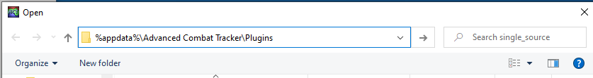

# Adder Plugin for Advanced Combat Tracker
This plugin was written to help with a specific stategy for a specific fight in EQII.

The fight is _The Abandonded Labomination_ in the _Vasty Deep: Toil and Trouble [Heroic II]_ zone.

During the fight, _The Abandoned Labomination_ (hereafter: _the mob_) obtains a buff and curses all players. 
Each player can then see a count on their curse in their detriment window. _The mob_ also has a count on its buff.
The strategy is to cure the curse on the two players whose curse count adds up to the count on _the mob_.

For those players that hate math, this plugin can do the chore for them.

To use the plugin, each player needs to do a /groupsay containing just their count. 
One (or more) player(s) also needs to do a /groupsay with the word _need_ followed by _the mob's_ count. 
The plugin takes that information and generates a text-to-speach announcement for which two players need to be cured.

An example of the players reporting the numbers is shown below:

Player | Action
-------|-------
Player1 |/g 57
Player2 |/g 32
Player3 |/g 21
Player4 |/g need 42
Player4 |/g 54
Player5 |/g 10
Player6 |/g 73

The above would result in the plugin looking like this:

and the __cure Player2 and Player5__ would be announced 
via text-to-speach as soon as the plugin finds a proper combination of numbers.

The plugin determines the current cycle from the previous one by looking in the _within 30 seconds_ time window.

# Installation

The plugin must be manually downloaded and installed. 
The steps you will be taking are:
* Download the file from the Releases page. 
  * You will need to leave this instructions page to do so.
* Install the downloaded file in ACT. 
  * Install instructions are on this page. Come back to this page after the download if you need to. 

Details are provided below. 

## Download

1. You might want to first read through all the steps since you will be leaving this page.
2. To go to the download page, click the following link: [Releases Page](https://github.com/jeffjl74/ACT_Adder/releases)
3. On the "Releases" page, for the __Latest release__, click the "Assets 3" title to expand the assets (if needed). 
The page with the expanded view will list three files.
4. Click the "Adder.cs" link, download and save the file. 
	* Pay attention to where the file was downloaded. 
It will typically be in your "Downloads" folder.
In the Chrome browser, you can select _Show in folder_ after the download to open the folder in File Explorer.

## Add the plugin to ACT
### Move the downloaded file (optional)
The _Adder.cs_ file may be used right where you downloaded it, or use the following steps to put it in
the folder in which ACT normally saves plugins.

1. In Windows, open a File Explorer and browse to wherever you saved the _Adder.cs_ file, 
(typically the _Download_ folder) 
select it and choose either _Copy_ or _Cut_.
2. ACT's preferred folder is accessed from the _App Data Folder_ link in the About tab in ACT. Click that link, shown below:

3. Then double-click the _Plugins_ folder in File Explorer

4. Paste the _Adder.cs_ file in the _Plugins_ folder.

### Add/Enable the plugin in ACT
1. In ACT, click the "Plugins" tab and its "Plugin Listing" tab. 

2. Click the [Browse...] button and navigate to where you saved "Adder.cs"
   * If you moved _Adder.cs_ to the _Plugins_ folder, you can get there by entering 
   `%appdata%\Advanced Combat Tracker\Plugins` 
   in the File Explorer navigation bar as shown below 

3. Select the "Adder.cs" file and press [Open]. 
Then press the [Add/Enable Plugin] button. 

You should now have a "Adder.cs" tab in your plugins tabs. Click on the tab to see the (empty) table. 

# Building the plugin from source
For ease of development and maintenance, the Visual Studio project consists of several separate source files. 
ACT wants a single file for run-time-compiled plugins. 
The Visual Studio build process included in the project builds a DLL, 
then runs the `merge_sources.py` python script to merge the separate source files 
into a single source file in the `single_source` folder. 
For development, debug, and testing, the DLL can be added to ACT as a plugin. 
